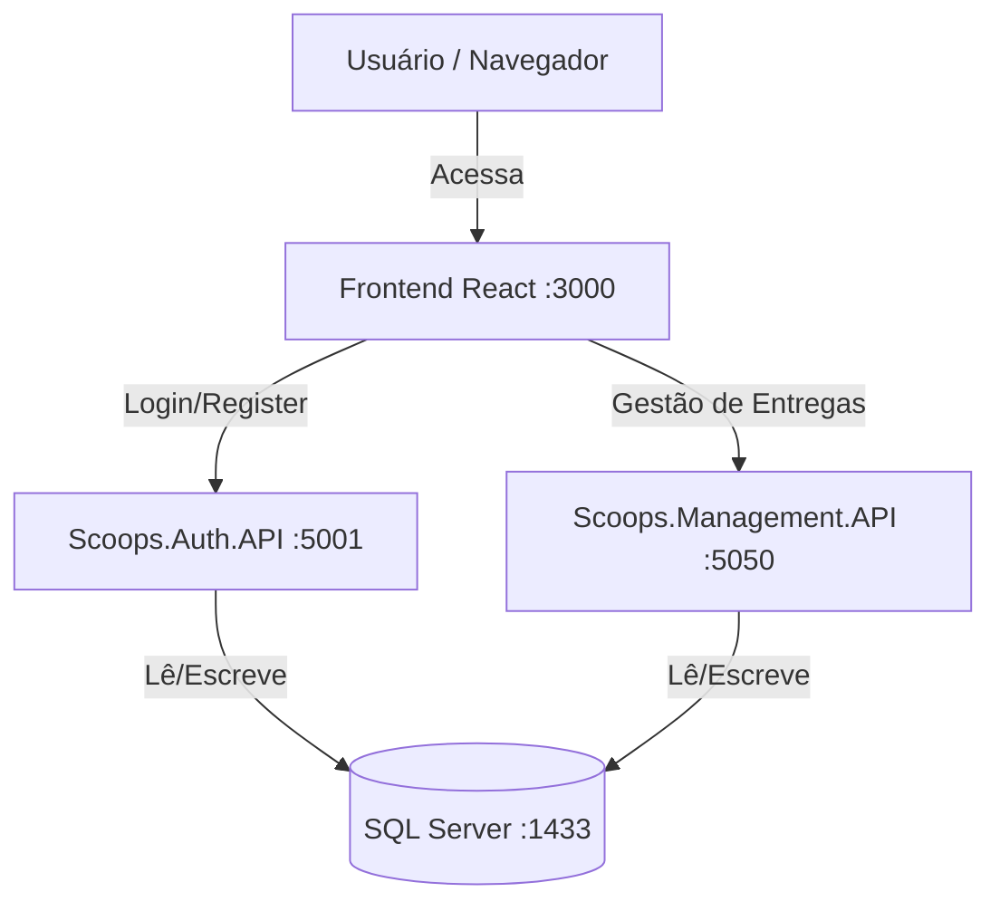

# 🍦 Scoops API - Plataforma de Gestão de Entregas


Este repositório contém a solução do desafio técnico para a vaga **Full Stack .NET**. O projeto consiste em um MVP (Minimum Viable Product) de uma arquitetura de microsserviços para gerenciar autenticação, fornecedores e entregas de estoque.

## 🏗️ Arquitetura

O sistema foi desenvolvido seguindo os princípios da **Clean Architecture** e **Microsserviços**, garantindo separação de responsabilidades, testabilidade e escalabilidade.

### Diagrama da Solução



### Componentes

- Scoops.Auth.API: Microsserviço responsável pelo cadastro de usuários e emissão de tokens JWT.

- Scoops.Management.API: Microsserviço responsável pelo cadastro de Fornecedores, Produtos e Registro de Entregas.

- Scoops Web: Frontend desenvolvido em React para interação com as APIs.

- SQL Server: Banco de dados relacional containerizado.

### Tecnologias Utilizadas

- Backend: .NET 8, C#, ASP.NET Core Web API

- ORM: Entity Framework Core (Code First)

- Banco de Dados: SQL Server 2022 (Docker)

- Autenticação: JWT (JSON Web Token) + BCrypt (Hash de Senha)

- Frontend: React.js, Axios, TailwindCSS (ou Styled Components)

- Infraestrutura: Docker & Docker Compose

- Documentação: Swagger (OpenAPI)

## Como Rodar o Projeto

A maneira mais fácil e recomendada de rodar o projeto é utilizando o **Docker Compose**.

Pré-requisitos

- Docker Desktop instalado e rodando.

- .NET SDK 8.0 (necessário apenas para rodar as migrations do banco).

## Passo a passo para rodar

1. Clonar o repositório:

```bash
git clone https://github.com/luiz-eduardo-ramirez/Scoops-API

cd scoops-backend-challenge
```

2. Rodar o Docker Compose:

```bash
docker compose up --build -d
```

3. Aguarde a inicialização:

O SQL Server pode levar de 10 a 30 segundos para estar pronto na primeira execução. Verifique o status com docker ps ou docker logs scoops-sql-server.

## Endpoints e Acesso

Após subir os containers, os serviços estarão disponíveis nas seguintes URLs:

```bash
Serviço	    URL	                                    Descrição
Frontend	http://localhost:3000	                Interface do Usuário
Auth        http://localhost:5001/swagger	        Documentação da API de Autenticação
Management  http://localhost:5050/swagger	        Documentação da API de Gestão
```

## Como Testar o Fluxo (MVP)

1. Acessar o Frontend em http://localhost:3000

2. Login com um usuário cadastrado admin@scoopsamanda.com | password

3. Acesso completo ao Frontend

### Estrutura do Projeto

```bash
ScoopsProject/
├── Scoops.Auth.API/          # Microsserviço de Autenticação
│   ├── Controllers/          # Endpoints da API (Camada de Apresentação)
│   ├── Domain/               # Entidades (User) e Regras de Negócio
│   ├── Infrastructure/       # DbContext e Configurações de Banco
│   └── Application/          # DTOs (Data Transfer Objects)
│
├── Scoops.Management.API/    # Microsserviço de Gestão
│   ├── Controllers/          # Endpoints (Deliveries, Products, Suppliers)
│   ├── Domain/               # Entidades (Supplier, Product, Delivery)
│   └── Infrastructure/       # DbContext e Migrations
│
├── scoops-web/               # Frontend React
│   ├── src/                  # Código fonte React
│   └── Dockerfile            # Configuração de Build e Nginx
│
├── docker-compose.yml        # Orquestração dos containers
└── README.md                 # Documentação do Projeto
```

## Autor

Desenvolvido por Luiz Eduardo como parte do processo seletivo para Desenvolvedor Full Stack .NET para a empresa Saggezza.
